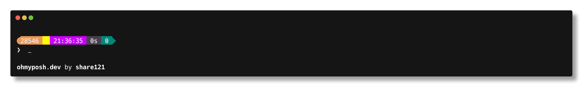

# share121 的 shell 主题



## 安装 Oh My Posh

https://ohmyposh.dev/

## 安装主题

### Windows

#### 打开配置文件脚本

```shell
notepad $PROFILE
```

> [!TIP]
> 如果没有配置文件，请创建一个
>
> ```shell
> New-Item -Path $PROFILE -Type File -Force
> ```

#### 添加以下内容

```shell
oh-my-posh init pwsh --config <路径>\share121.json | Invoke-Expression
```

## 鸣谢

修改自
[jtracey93](https://github.com/JanDeDobbeleer/oh-my-posh/blob/main/themes/jtracey93.omp.json)
的主题
